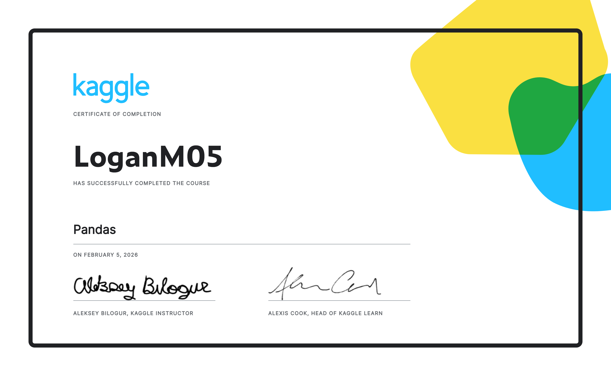
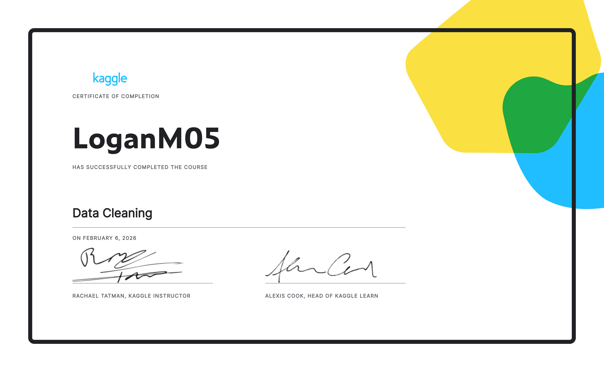

# Kaggle Certs

## Completed
|   |   |
|---|---|
| | 
|  | 

## In Progress

| Course | Progress |
|---|---|
| [Data Visualization](https://www.kaggle.com/learn/data-visualization) | 
| [Intro to Game AI and Reinforcement Learning](https://www.kaggle.com/learn/intro-to-game-ai-and-reinforcement-learning) | 

## Planned

[Intro to Machine Learning](https://www.kaggle.com/learn/intro-to-machine-learning)

[Intermediate Machine Learning](https://www.kaggle.com/learn/intermediate-machine-learning)

[Feature Engineering](https://www.kaggle.com/learn/feature-engineering)

[Intro to Deep Learning](https://www.kaggle.com/learn/intro-to-deep-learning)

[Computer Vision](https://www.kaggle.com/learn/computer-vision)