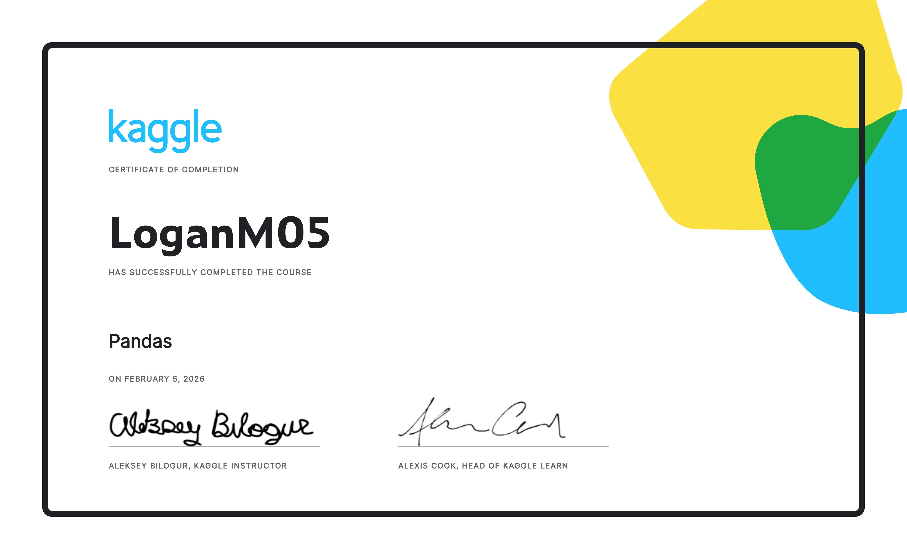
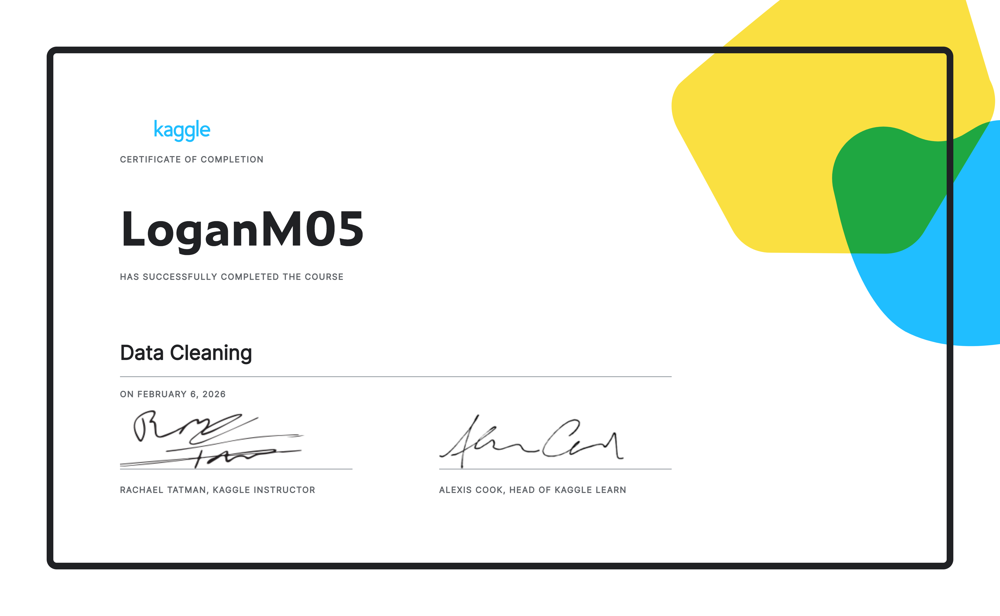
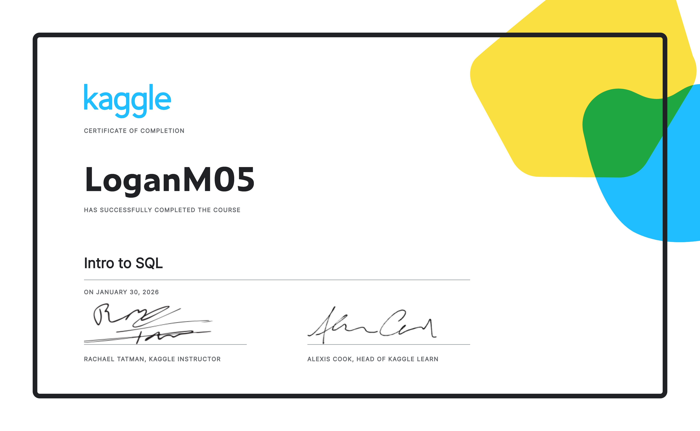
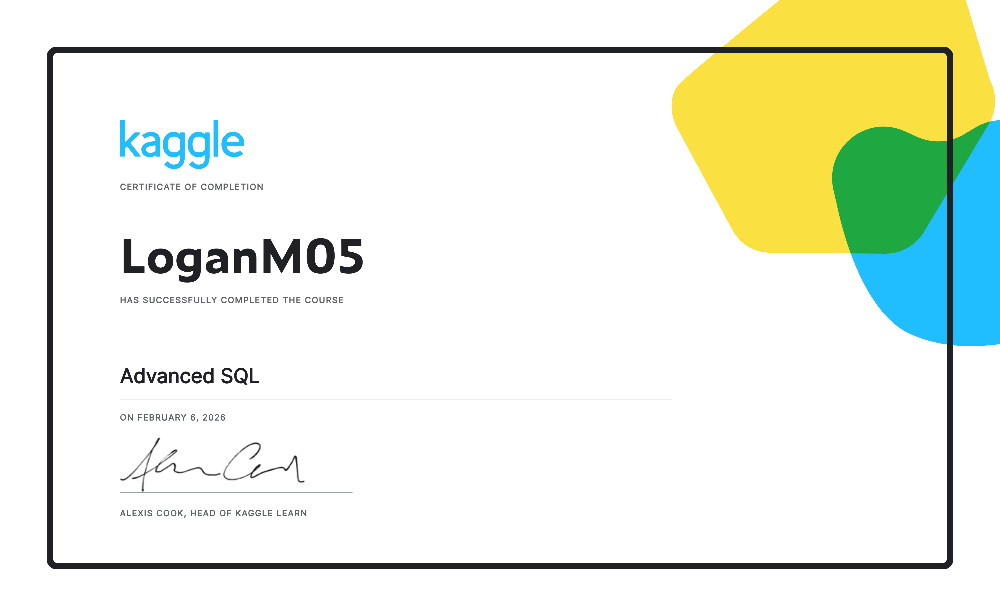
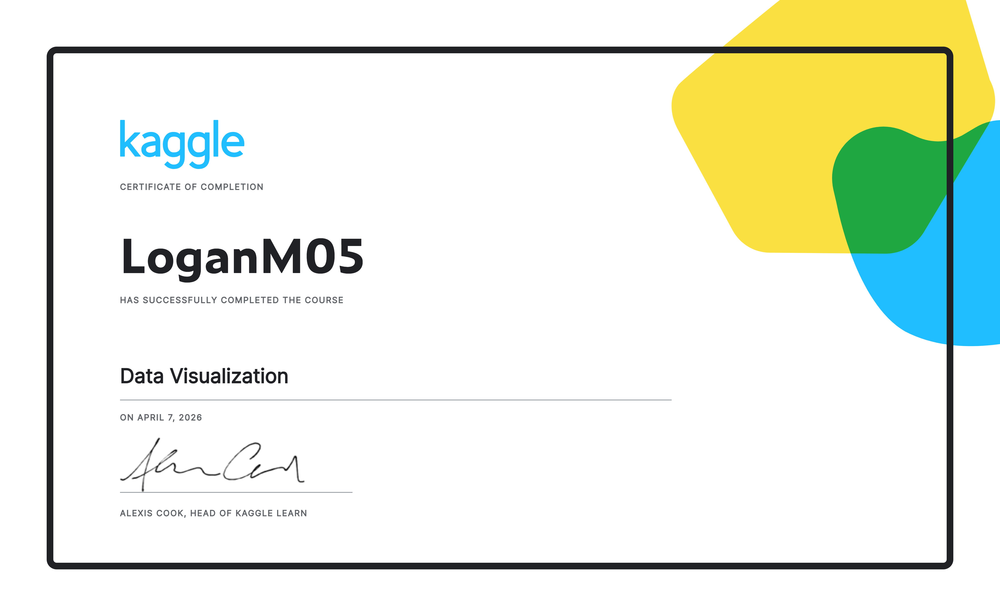
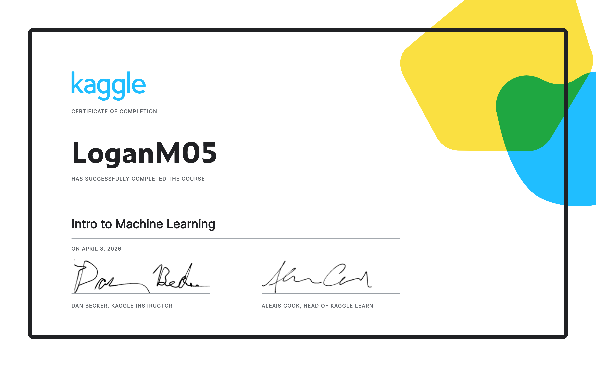
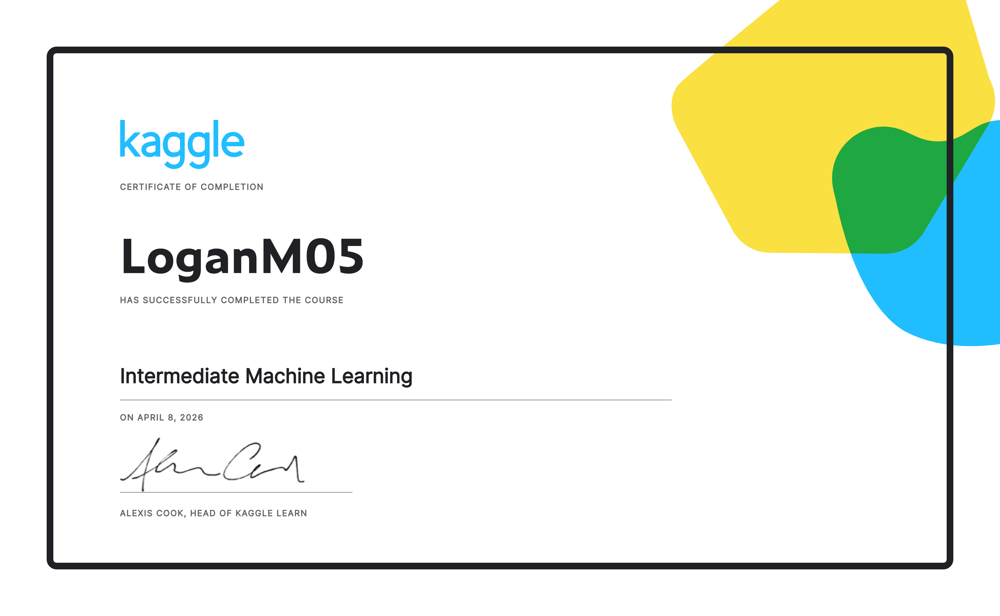

# Kaggle Certs

## Completed
|   |   |
|---|---|
| | 
|  | 
|  | 
| 

## In Progress

| Course | Progress |
|---|---|
| [Feature Engineering](https://www.kaggle.com/learn/feature-engineering) | 

## Planned

[Machine Learning Explainability](https://www.kaggle.com/learn/machine-learning-explainability)

[Time Series](https://www.kaggle.com/learn/time-series)

[Intro to Deep Learning](https://www.kaggle.com/learn/intro-to-deep-learning)

[Computer Vision](https://www.kaggle.com/learn/computer-vision)

[Intro to Game AI and Reinforcement Learning](https://www.kaggle.com/learn/intro-to-game-ai-and-reinforcement-learning)