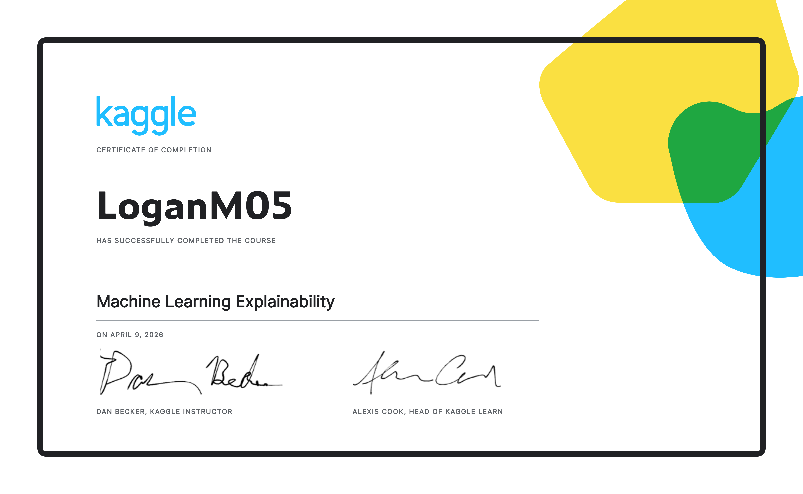
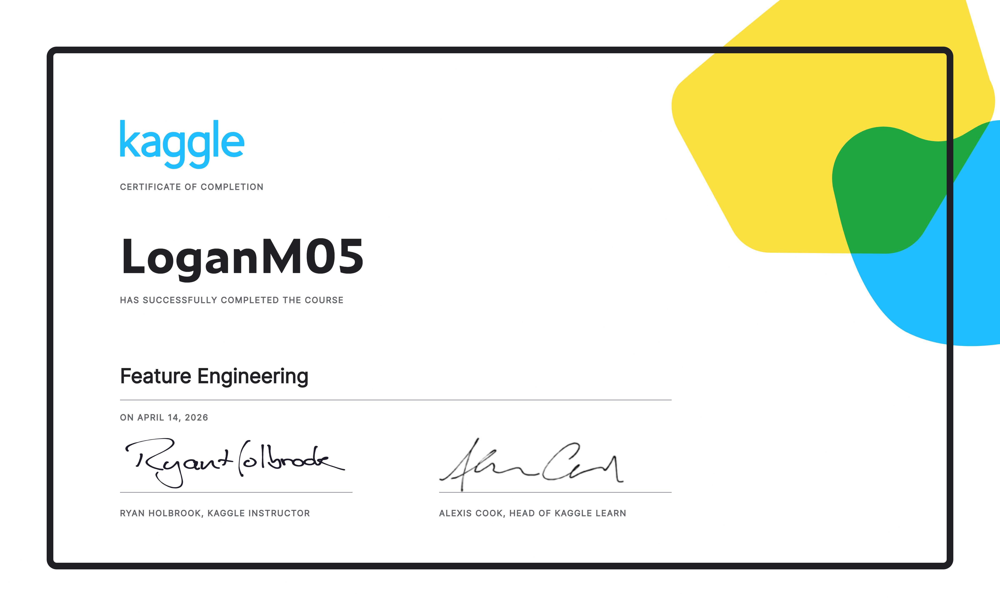
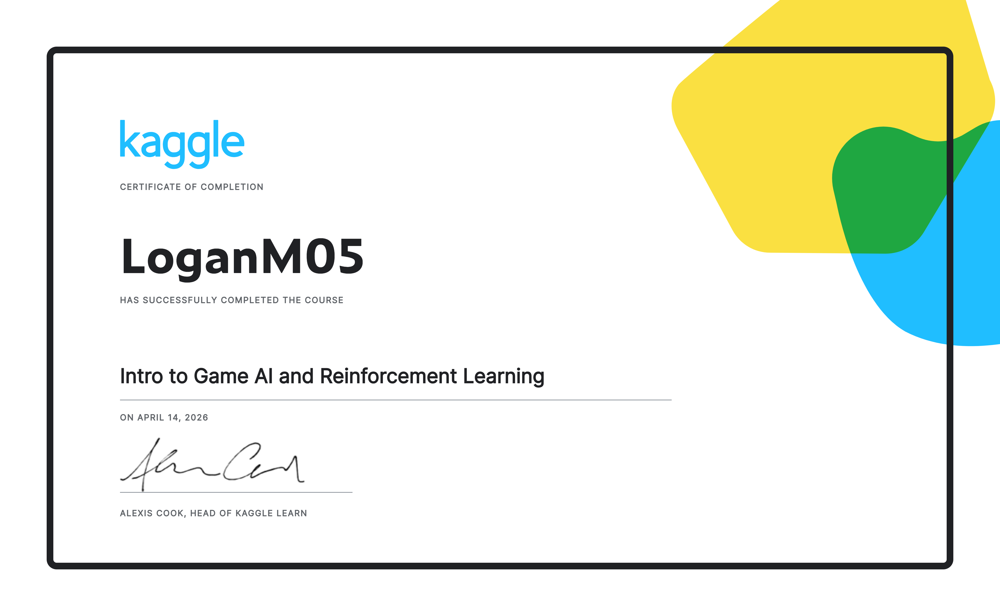

# Kaggle Certs

## Completed
|   |   |
|---|---|
| | 
|  | 
|  | 
|  | 
|  | 

## In Progress

| Course | Progress |
|---|---|
| [Time Series](https://www.kaggle.com/learn/time-series) | 

## Planned

[Intro to Deep Learning](https://www.kaggle.com/learn/intro-to-deep-learning)

[Computer Vision](https://www.kaggle.com/learn/computer-vision)